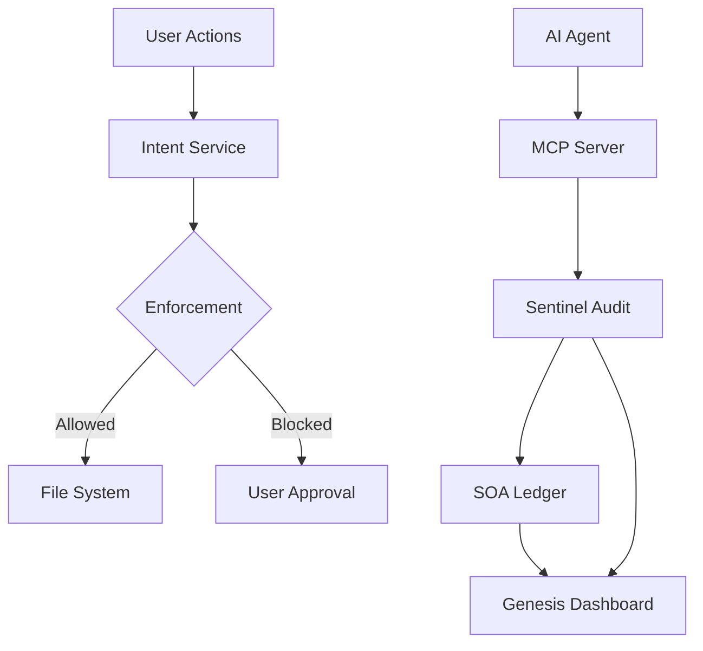

# 🛡️ FailSafe (feat. QoreLogic)

> **Complete AI Governance, Monitoring, and Verification for the Modern Developer.**

FailSafe is a state-of-the-art VS Code extension and governance framework designed to harmonize AI agent behavior, prevent hallucinations, and enforce strict architectural standards across distributed development environments.

---

## 🌌 The Three Pillars of FailSafe

### 1. 🎨 Genesis (The Experience Layer)

The visual and interactive core of FailSafe.

- **Living Graph**: Real-time visualization of your project's architectural integrity and AI influence.
- **Cortex Stream**: A neurological activity feed showing every decision made by AI agents in your workspace.
- **Feedback Loop**: Integrated community feedback mechanism to capture and resolve AI edge cases.

### 2. ⚖️ QoreLogic (The Governance Layer)

The "Constitution" for your AI agents.

- **Universal Identity Propagation**: Seamlessly sync QoreLogic identities across **Antigravity**, **Claude CLI**, **Cursor**, **Codex**, and **KiloCode**.
- **SOA Ledger**: A Merkle-tree backed verifiable log of all high-stakes (L2/L3) AI decisions.
- **Intent Service**: Cryptographic locking of the workspace—no AI writes are permitted without a verified "Intent."

### 3. 👁️ Sentinel (The Enforcement Layer)

Active monitoring that never sleeps.

- **Heuristic Audit Engine**: Blazing fast, local scanning of every file write to detect complexity bloat or security risks.
- **Existence Engine**: Ensures AI-generated code doesn't just "look right," but actually exists and adheres to the physical constraints of the project.
- **MCP Server Federation**: Standardized Model Context Protocol (MCP) server allowing external agents to interact with FailSafe's internal auditing tools.

---

## 🚀 Getting Started

### Prerequisites

- **VS Code** 1.74.0+
- **Node.js** 18+
- **Ollama** (Optional, for LLM-assisted Sentinel audits)

### Installation

1. Clone the repository:
   ```bash
   git clone https://github.com/MythologIQ/FailSafe.git
   ```
2. Navigate to the extension directory:
   ```bash
   cd FailSafe/extension
   ```
3. Install dependencies:
   ```bash
   npm install
   ```
4. Compile the project:
   ```bash
   npm run compile
   ```

### Running Locally

- Press `F5` in VS Code to launch the **Extension Development Host**.
- Use `Ctrl+Alt+F` to open the FailSafe Dashboard.
- Use `Ctrl+Alt+A` to trigger a manual Sentinel Audit.

---

## 🛠️ Architecture



---

## 📜 Governance Models

The `/qorelogic` directory contains the source-of-truth instructions for all supported platforms:

- **Antigravity**: JSON Orbits & Workflows.
- **Cursor**: `.mdc` Rules.
- **Codex**: `GOVERNANCE.md` directives.
- **KiloCode**: YAML policy mappings.

---

## 🛡️ Security & Integrity

FailSafe utilizes a **Triple-Pass Verification** strategy:

1. **Static Heuristics** (Instant)
2. **Contextual Peer Review** (MCP/Tribunal)
3. **Formal Ledger Logging** (Immutable)

---

Developed with ❤️ by **MythologIQ**.  
_Ensuring the future of AI development is safe, transparent, and beautiful._
