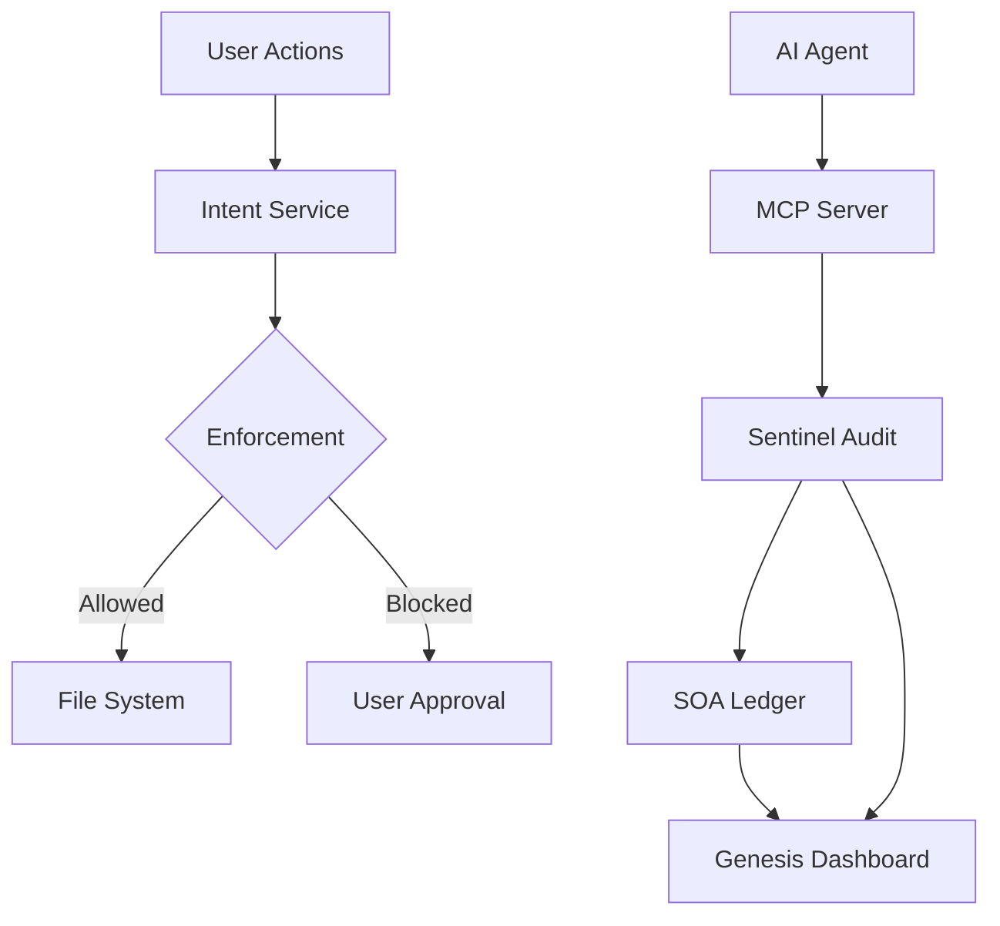

<div align="center">

# FailSafe

**Governance for AI-assisted development in VS Code.**

*Local-first safety for AI coding assistants.*

[](https://github.com/MythologIQ/FailSafe/stargazers)
[](LICENSE)
[](#terms-and-conditions-beta)
[](https://nodejs.org)
[](https://www.typescriptlang.org)
[](https://marketplace.visualstudio.com/items?itemName=MythologIQ.mythologiq-failsafe)
[](https://open-vsx.org/extension/MythologIQ/mythologiq-failsafe)
[](https://github.com/MythologIQ/FailSafe/releases)
[](docs/FAILSAFE_SPECIFICATION.md)

**Current Release**: v2.0.1 (2026-02-05)

> **If this project helps you, please star it!** It helps others discover FailSafe.

[Quick Start](#quick-example) | [Documentation](docs/FAILSAFE_SPECIFICATION.md) | [VS Code Extension](https://marketplace.visualstudio.com/items?itemName=MythologIQ.mythologiq-failsafe) | [Open VSX](https://open-vsx.org/extension/MythologIQ/mythologiq-failsafe) | [Roadmap](docs/ROADMAP.md)

<br/>

_FailSafe is open source. Fork it, open issues, and submit pull requests._

> **BETA NOTICE:** FailSafe is a beta product. Expect breaking changes and rough edges. See [Terms and Conditions (Beta)](#terms-and-conditions-beta).

</div>

---

<p align="center">
  
</p>

---

## What You Will Configure in 5 Minutes

Create or edit `.failsafe/config/policies/risk_grading.json` to tune risk classification:

```json
{
  "filePathTriggers": {
    "L3": ["auth", "payment", "credential"]
  },
  "contentTriggers": {
    "L3": ["DROP TABLE", "api_key"]
  }
}
```

**Result:** Risk grading overrides are loaded on startup when this JSON file is present. Defaults apply when it is missing. Top-level sections replace defaults, so include full sections if you want to preserve them.

---

## What Is FailSafe?

FailSafe is an open-source VS Code extension and governance framework for AI-assisted development. It adds intent-gated saves, Sentinel audits, and a ledgered audit trail so risky changes are surfaced and controlled.

---

## The Idea

**Prompt-based safety** asks the LLM to follow rules. The LLM decides whether to comply.

**Kernel-style safety** evaluates actions at the editor boundary using policies, heuristics, and optional LLM analysis.

---

## Architecture



---

## Directory Structure

FailSafe uses a **Physical Isolation** model to separate workspace governance from application development.

### Workspace Root (Governance)

```
/ (root)
├── .agent/                   # Active workspace workflows
├── .claude/                  # Active commands + secure tokens
├── .qorelogic/               # Workspace configuration (locked)
├── docs/                     # Workspace governance (Ledger, State, Spec)
└── FAILSAFE_SPECIFICATION.md -> docs/FAILSAFE_SPECIFICATION.md
```

### App Container (Extension Source)

```
/FailSafe/ (container)
├── extension/                # VSCode Extension TypeScript Project
├── Antigravity/              # Gemini AI workflows
├── Claude/                   # Claude AI workflows
├── VSCode/                   # VSCode Copilot prompts
└── build/                    # Build & validation tooling
```

---

## Core Systems

| System    | Layer       | Description                                |
| --------- | ----------- | ------------------------------------------ |
| Genesis   | Experience  | Dashboard, living graph, and audit stream  |
| QoreLogic | Governance  | Intent gating, policies, ledger, and trust |
| Sentinel  | Enforcement | File watcher audits and verdicts           |

---

## IDE Extension

| Extension | Description                                  |
| --------- | -------------------------------------------- |
| VS Code   | Save-time governance, audits, and dashboards |

---

## Install

FailSafe provides governance for multiple AI development environments:

### VS Code Extension (Save-Time Governance)

Install the FailSafe extension for real-time governance, audits, and dashboards.

**VS Code Marketplace:**
```
ext install MythologIQ.mythologiq-failsafe
```
Or: https://marketplace.visualstudio.com/items?itemName=MythologIQ.mythologiq-failsafe

**Open VSX (VSCodium, Gitpod, etc.):**
```
ext install MythologIQ.mythologiq-failsafe
```
Or: https://open-vsx.org/extension/MythologIQ/mythologiq-failsafe

---

### Claude Code (Slash Commands)

Download the Claude Code artifact from [Releases](https://github.com/MythologIQ/FailSafe/releases).

**Installation:**
```bash
# Extract to your Claude commands directory
unzip failsafe-claude-v*.zip -d ~/.claude/commands/

# Verify installation
ls ~/.claude/commands/
```

**Available Commands:**
- `/ql-bootstrap` - Initialize workspace governance
- `/ql-status` - Quick lifecycle check
- `/ql-plan` - Create implementation plans
- `/ql-audit` - Gate tribunal for plans
- `/ql-implement` - Execute implementation
- `/ql-substantiate` - Session seal with Merkle verification

---

### Antigravity / Gemini (Workflows)

Download the Antigravity artifact from [Releases](https://github.com/MythologIQ/FailSafe/releases).

**Installation:**
```bash
# Extract to your project root
unzip failsafe-antigravity-v*.zip -d ./

# This creates:
#   .agent/workflows/     - A.E.G.I.S. workflow files
#   .qorelogic/orbits/    - Persona files (Governor, Judge, Specialist)
#   .qorelogic/skills/    - Skill definitions
```

---

### VSCode Copilot (Prompts)

Download the VSCode Copilot artifact from [Releases](https://github.com/MythologIQ/FailSafe/releases).

**Installation:**
```bash
# Extract to your project root
unzip failsafe-vscode-copilot-v*.zip -d ./

# This creates:
#   .github/prompts/              - Copilot prompt files
#   .github/copilot-instructions/ - Agent personas
#   .failsafe/config/             - Governance configuration
#   .failsafe/skills/             - Skill definitions
```

---

## Quick Example

```bash
# Run FailSafe locally
cd FailSafe/extension
npm install
npm run compile
```

---

## Status

This is a beta product. Expect breaking changes and rough edges.

---

## Terms and Conditions (Beta)

FailSafe is a beta product. It is provided "as is" without warranties of any kind, and may contain bugs, incomplete features, or breaking changes.

By using this software, you acknowledge that it is experimental and agree to use it at your own risk. MythologIQ is not liable for any loss of data, downtime, or other damages arising from use of this beta release.

---

## Contributing

```bash
git clone https://github.com/MythologIQ/FailSafe.git
cd FailSafe
npm install
```

---

## License

MIT - See [LICENSE](LICENSE)

---

<div align="center">

**Open source governance for autonomous AI agents.**

[GitHub](https://github.com/MythologIQ/FailSafe) | [Docs](FAILSAFE_SPECIFICATION.md)

</div>
