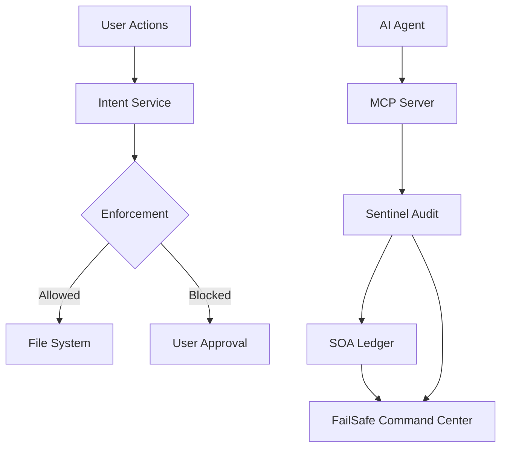

<div align="center">

# FailSafe

**AI Governance & Safety for AI-Assisted Development**

_Local-first safety for AI coding assistants._

**Marketplace Categories**: Machine Learning, Testing, Visualization

[](https://github.com/MythologIQ/FailSafe/stargazers)
[](LICENSE)
[](#terms-and-conditions-beta)
[](https://nodejs.org)
[](https://www.typescriptlang.org)
[](https://marketplace.visualstudio.com/items?itemName=MythologIQ.mythologiq-failsafe)
[](https://open-vsx.org/extension/MythologIQ/mythologiq-failsafe)
[](https://github.com/MythologIQ/FailSafe/releases)
[](docs/FAILSAFE_SPECIFICATION.md)

**Current Release**: v4.0.0 (2026-02-27)

> **If this project helps you, please star it!** It helps others discover FailSafe.

[Quick Start](#quick-example) | [Documentation](docs/FAILSAFE_SPECIFICATION.md) | [VS Code Extension](https://marketplace.visualstudio.com/items?itemName=MythologIQ.mythologiq-failsafe) | [Open VSX](https://open-vsx.org/extension/MythologIQ/mythologiq-failsafe) | [Roadmap](docs/ROADMAP.md)

<br/>

_FailSafe is open source. Fork it, open issues, and submit pull requests._

> **BETA NOTICE:** FailSafe is a beta product. Expect breaking changes and rough edges. See [Terms and Conditions (Beta)](#terms-and-conditions-beta).

</div>

---

<p align="center">
  
</p>

## UI Preview


---

## What You Will Configure in 5 Minutes

Create or edit `.failsafe/config/policies/risk_grading.json` to tune risk classification:

```json
{
  "filePathTriggers": {
    "L3": ["auth", "payment", "credential"]
  },
  "contentTriggers": {
    "L3": ["DROP TABLE", "api_key"]
  }
}
```

**Result:** Risk grading overrides are loaded on startup when this JSON file is present. Defaults apply when it is missing. Top-level sections replace defaults, so include full sections if you want to preserve them.

---

## What Is FailSafe?

FailSafe is an open-source VS Code extension and governance framework for AI-assisted development. It adds intent-gated saves, Sentinel audits, and a ledgered audit trail so risky changes are surfaced and controlled.

FailSafe separates system awareness from system control.

The Monitor provides real-time visibility into system health, governance posture, and operational risk. It is designed for continuous, low-effort awareness.

The Command Center is the primary control surface where teams plan, execute, and govern AI workflows. All configuration, orchestration, and audits originate here.

This separation reduces cognitive load and mirrors real-world operations environments: observe first, act deliberately.

Primary UI surfaces in the current release:

- `FailSafe Monitor` (compact)
- `FailSafe Command Center` (extended)

## UI Screenshots

### Monitor


### Home


### Skills


### Governance


---

## The Idea

**Prompt-based safety** asks the LLM to follow rules. The LLM decides whether to comply.

**Kernel-style safety** evaluates actions at the editor boundary using policies, heuristics, and optional LLM analysis.

---

## Architecture



---

## Directory Structure

FailSafe uses a **Physical Isolation** model to separate workspace governance from application development.

### Workspace Root (Governance)

```
/ (root)
+-- .agent/                   # Active workspace workflows
+-- .claude/                  # Active commands + secure tokens
+-- .qorelogic/               # Workspace configuration (locked)
+-- docs/                     # Workspace governance (Ledger, State, Spec)
+-- FAILSAFE_SPECIFICATION.md -> docs/FAILSAFE_SPECIFICATION.md
```

### App Container (Extension Source)

```
/FailSafe/ (container)
+-- extension/                # VSCode Extension TypeScript Project
+-- Antigravity/              # Gemini + Claude workflows (source)
+-- VSCode/                   # Copilot + Claude prompts (source)
+-- PROD-Extension/           # Production builds (includes Claude)
¦   +-- Antigravity/          # ? OpenVSX (Gemini + Claude)
¦   +-- VSCode/               # ? VS Code Marketplace (Copilot + Claude)
+-- build/                    # Build & validation tooling
```

**Note:** Claude Code is no longer a separate build. Claude-specific skills, commands, and file structures are folded into both Antigravity and VSCode extensions.

---

## Core Systems

| System    | Layer       | Description                                |
| --------- | ----------- | ------------------------------------------ |
| Genesis   | Experience  | FailSafe Monitor + FailSafe Command Center |
| QoreLogic | Governance  | Intent gating, policies, ledger, and trust |
| Sentinel  | Enforcement | File watcher audits and verdicts           |

### Governance Modes

FailSafe supports three governance modes to match your workflow needs:

| Mode        | Behavior                                                           | Best For                         |
| ----------- | ------------------------------------------------------------------ | -------------------------------- |
| **Observe** | No blocking, just visibility and logging. Zero friction.           | New users, exploration, learning |
| **Assist**  | Smart defaults, auto-intent creation, gentle prompts. Recommended. | Most development workflows       |
| **Enforce** | Full control, intent-gated saves, L3 approvals.                    | Compliance, regulated industries |

Switch modes via the `FailSafe: Set Governance Mode` command or the `failsafe.governance.mode` setting.

---

## QoreLogic: The Governance Layer

QoreLogic is the deterministic governance engine that enforces safety policies at the editor boundary. It operates on a fundamental principle: **governance decisions are made by code, not by asking an LLM to follow rules.**

### Prompt Guidelines vs. Deterministic Governance

| Aspect             | Prompt-Based Safety                     | QoreLogic Deterministic Governance   |
| ------------------ | --------------------------------------- | ------------------------------------ |
| **Decision Maker** | LLM interprets rules                    | TypeScript code executes rules       |
| **Consistency**    | Varies with context, temperature, model | Identical output for identical input |
| **Auditability**   | Opaque reasoning chain                  | Explicit code path, logged decisions |
| **Bypass Risk**    | LLM can ignore or reinterpret           | Code cannot be persuaded             |
| **Speed**          | Network latency + inference             | Sub-millisecond local execution      |

### How QoreLogic Works

1. **Risk Classification** — Files are classified as L1 (low), L2 (medium), or L3 (high) risk based on:
   - File path triggers (e.g., `auth/`, `payment/`, `credential` → L3)
   - Content triggers (e.g., `DROP TABLE`, `api_key`, `private_key` → L3)
   - Configurable via `.failsafe/config/policies/risk_grading.json`

2. **Policy Evaluation** — Each risk grade has deterministic requirements:
   - **L1**: Heuristic check, 10% sampling, auto-approve
   - **L2**: Full Sentinel pass, no auto-approve
   - **L3**: Formal verification + human approval required

3. **Ledger Recording** — Every governance decision is recorded to an append-only SOA ledger with:
   - Agent identity and trust score
   - Artifact path and risk grade
   - Timestamp and decision rationale

4. **Trust Dynamics** — Agent trust scores evolve based on outcomes:
   - Approved L3 actions → trust increase
   - Rejected or failed actions → trust decrease
   - Trust scores influence future routing decisions

### Why Deterministic Matters

When an LLM is asked to enforce safety rules, it can:

- Reinterpret rules based on context
- Produce inconsistent decisions across similar inputs
- Be influenced by prompt engineering attacks

QoreLogic avoids these risks by executing deterministic TypeScript code at the governance boundary. The policy engine uses simple string matching and path analysis—no LLM inference required for governance decisions.

**Example**: A file containing `api_key` will always trigger L3 classification. No prompt can persuade the code to ignore this trigger.

---

## IDE Extension

| Extension | Description                                  |
| --------- | -------------------------------------------- |
| VS Code   | Save-time governance, audits, and dashboards |

---

## Install

FailSafe provides governance for multiple AI development environments:

### VS Code Extension (Save-Time Governance)

Install the FailSafe extension for real-time governance, audits, and dashboards.

**VS Code Marketplace:**

```
ext install MythologIQ.mythologiq-failsafe
```

Or: https://marketplace.visualstudio.com/items?itemName=MythologIQ.mythologiq-failsafe

**Open VSX (VSCodium, Gitpod, etc.):**

```
ext install MythologIQ.mythologiq-failsafe
```

Or: https://open-vsx.org/extension/MythologIQ/mythologiq-failsafe

---

### Antigravity Extension (Gemini + Claude Code)

Install from **Open VSX** (VSCodium, Gitpod, Cursor, etc.):

```
ext install MythologIQ.mythologiq-failsafe
```

Or: https://open-vsx.org/extension/MythologIQ/mythologiq-failsafe

The Antigravity extension includes:

- **Gemini/Antigravity workflows** (`.agent/workflows/`)
- **Claude Code commands** (`.claude/commands/`)
- **QoreLogic personas** (Governor, Judge, Specialist)
- **Governance configuration** and skills

---

### VSCode Copilot Extension (Copilot + Claude Code)

Install from **VS Code Marketplace**:

```
ext install MythologIQ.mythologiq-failsafe
```

Or: https://marketplace.visualstudio.com/items?itemName=MythologIQ.mythologiq-failsafe

The VSCode extension includes:

- **Copilot prompt files** (`.github/prompts/`)
- **Claude Code commands** (`.claude/commands/`)
- **Agent personas** (`.github/copilot-instructions/`)
- **Governance configuration** and skills

### The SHIELD Workflow (Claude Code)

Both extensions include Claude Code slash commands that map to the physical **SHIELD** governance lifecycle:

- **S - SECURE INTENT** (`/ql-bootstrap`): Seed project DNA. Document the Why, encode the architecture, initialize the Merkle chain.
- **H - HYPOTHESIZE** (`/ql-plan`): Create implementation blueprints with risk grades, file contracts, and Section 4 complexity limits.
- **I - INTERROGATE** (`/ql-audit`): Adversarial tribunal. The Judge audits the plan for security, correctness, and drift. PASS or VETO.
- **E - EXECUTE** (`/ql-implement`): Build under KISS constraints after a PASS verdict. Functions under 40 lines. Nesting under 3 levels.
- **L - LOCK PROOF** (`/ql-substantiate`): Verify Reality matches Promise. Cryptographically seal the session with Merkle hash verification.
- **D - DELIVER** (`/ql-release`): Deploy, hand off with traceability, and monitor for operational drift.

---

## Quick Example

```bash
# Run FailSafe locally
cd FailSafe/extension
npm install
npm run compile
```

---

## What's New in v4.0.0

- **Token Economics Dashboard**: Real-time visibility into prompt token usage, RAG savings, and cost-per-action metrics. Open via `FailSafe: Token Economics Dashboard` or `Ctrl+Alt+F` from the Command Center.
- **Governance Modes**: Three modes to match your workflow — Observe (zero friction), Assist (smart defaults), and Enforce (full control with intent-gated saves).
- **Chat Participant**: Use `@failsafe` in VS Code chat for governance queries — `/intent`, `/audit`, `/trust`, `/status`, `/seal`.
- **Risk Register & Transparency Stream**: Dedicated sidebar panels for risk tracking and real-time governance event visibility.
- **API-First Service Isolation**: Economics module built with zero VS Code dependencies, designed for future extraction to standalone runtimes.

### Getting Started with Token Economics

1. Install FailSafe from the [VS Code Marketplace](https://marketplace.visualstudio.com/items?itemName=MythologIQ.mythologiq-failsafe) or [Open VSX](https://open-vsx.org/extension/MythologIQ/mythologiq-failsafe).
2. Open the Command Palette (`Ctrl+Shift+P`) and run `FailSafe: Token Economics Dashboard`.
3. The dashboard displays token savings, context sync ratio, and daily cost aggregates as your workspace generates governance events.
4. Data persists locally in `.failsafe/economics/` — no external services required.

> **Enjoying FailSafe?** Please consider leaving a review on the [VS Code Marketplace](https://marketplace.visualstudio.com/items?itemName=MythologIQ.mythologiq-failsafe) or [Open VSX](https://open-vsx.org/extension/MythologIQ/mythologiq-failsafe). Your feedback helps other developers discover FailSafe and directly shapes its roadmap.

---

## Upcoming Features (On the Roadmap)

- **FailSafe Revert ("Time-Travel")**: One-click remediation to revert AI code changes, reset Git head, and purge poisoned context.
- **CI/CD Pipeline Enforcer**: Headless Judge verification validating `failsafe_checkpoints` via cryptography during PRs.
- **Shared "Core Axioms"**: IDE startup synchronization of enterprise-level Policy and Axioms to enforce team-wide Q-DNA compliance.
- **Visual Chain of Governance**: Real-time tracing of the Tribunal workflow showing Governor, Executor, and Judge activities.
- **Air-Gapped Judge Verification**: Support for routing L3 architectural audits to local LLMs (Ollama, LM Studio, etc.) for zero-leak compliance.

---

## Status

This is a beta product. Expect breaking changes and rough edges.

---

## Terms and Conditions (Beta)

FailSafe is a beta product. It is provided "as is" without warranties of any kind, and may contain bugs, incomplete features, or breaking changes.

By using this software, you acknowledge that it is experimental and agree to use it at your own risk. MythologIQ is not liable for any loss of data, downtime, or other damages arising from use of this beta release.

---

## Contributing

```bash
git clone https://github.com/MythologIQ/FailSafe.git
cd FailSafe
npm install
```

---

## License

MIT - See [LICENSE](LICENSE)

---

<div align="center">

**Open source governance for autonomous AI agents.**

[GitHub](https://github.com/MythologIQ/FailSafe) | [Docs](FAILSAFE_SPECIFICATION.md)

</div>

<!-- CHECKPOINT-DEEP-DIVE:START -->

## UI Snapshot


## Checkpoint Integrity and Local Memory

FailSafe tracks more than Git state. It records governance checkpoints as signed metadata records, then stores Sentinel observations in a local retrieval store so operators can recover the _what_, _why_, and _how_ of runtime decisions.

### Process Reality

1. Git readiness is enforced at bootstrap (`ensureGitRepositoryReady`), including optional auto-install and `git init` when needed.
2. Governance events are checkpointed into `failsafe_checkpoints` with run/phase/status context and deterministic hashes.
3. Each checkpoint carries `git_hash`, `payload_hash`, `entry_hash`, and `prev_hash` so chain integrity can be recomputed.
4. Hub and API surfaces expose both summary and recent checkpoint records for operational visibility.
5. Sentinel writes local memory records to `.failsafe/rag/sentinel-rag.db` (or JSONL fallback), including `payload_json`, `metadata_json`, and retrieval text.

### Technical Advantages

- Tamper evidence via hash-chained checkpoint records.
- Git-linked governance state for repository-correlated audit trails.
- Local-first memory retention for security and low-latency recall.
- Deterministic fallback paths when SQLite is unavailable.

### Claim-to-Source Map

| Claim                                                                                       | Status      | Source                                                                                                                                                                                                         |
| ------------------------------------------------------------------------------------------- | ----------- | -------------------------------------------------------------------------------------------------------------------------------------------------------------------------------------------------------------- |
| Checkpoints persist in `failsafe_checkpoints` with typed governance fields.                 | implemented | `FailSafe/extension/src/roadmap/RoadmapServer.ts:1533-1556`                                                                                                                                                    |
| Checkpoint records include hash-chain material (`payload_hash`, `entry_hash`, `prev_hash`). | implemented | `FailSafe/extension/src/roadmap/RoadmapServer.ts:1689-1695`                                                                                                                                                    |
| Each checkpoint captures current Git head/hash context.                                     | implemented | `FailSafe/extension/src/roadmap/RoadmapServer.ts:1647`                                                                                                                                                         |
| Checkpoint history and chain validity are exposed over API.                                 | implemented | `FailSafe/extension/src/roadmap/RoadmapServer.ts:331`                                                                                                                                                          |
| Hub snapshot includes `checkpointSummary` and `recentCheckpoints`.                          | implemented | `FailSafe/extension/src/roadmap/RoadmapServer.ts:742-743`                                                                                                                                                      |
| Sentinel local RAG persists observation payload + metadata + retrieval text.                | implemented | `FailSafe/extension/src/sentinel/SentinelRagStore.ts:60-81`                                                                                                                                                    |
| Sentinel RAG can fall back to JSONL when SQLite is unavailable.                             | implemented | `FailSafe/extension/src/sentinel/SentinelRagStore.ts:85-91`                                                                                                                                                    |
| RAG writes are controlled by `failsafe.sentinel.ragEnabled` (default `true`).               | implemented | `FailSafe/extension/src/sentinel/SentinelDaemon.ts:339-341`                                                                                                                                                    |
| Checkpoint rows are directly foreign-key linked to Sentinel RAG rows.                       | unknown     | No explicit join/foreign key in `RoadmapServer` checkpoint insert (`FailSafe/extension/src/roadmap/RoadmapServer.ts:1689`) or Sentinel RAG insert (`FailSafe/extension/src/sentinel/SentinelRagStore.ts:103`). |

<!-- CHECKPOINT-DEEP-DIVE:END -->
