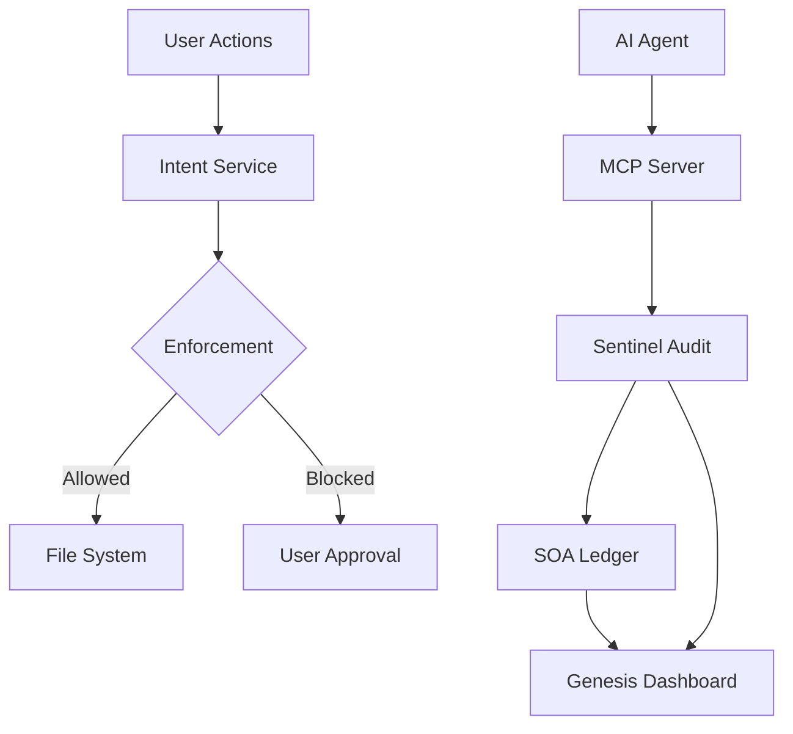

# FailSafe

**A kernel architecture for governing autonomous AI agents**

[](https://github.com/MythologIQ/FailSafe/stargazers)
[](LICENSE)
[](#terms-and-conditions-beta)
[](https://nodejs.org)
[](https://www.typescriptlang.org)
[](https://marketplace.visualstudio.com/items?itemName=MythologIQ.mythologiq-failsafe)
[](https://open-vsx.org/extension/MythologIQ/mythologiq-failsafe)
[](FAILSAFE_SPECIFICATION.md)

> **If this project helps you, please star it!** It helps others discover FailSafe.

[Getting Started](#getting-started) | [Specification](FAILSAFE_SPECIFICATION.md) | [VS Code Extension](https://marketplace.visualstudio.com/items?itemName=MythologIQ.mythologiq-failsafe) | [Open VSX](https://open-vsx.org/extension/MythologIQ/mythologiq-failsafe) | [Roadmap](ROADMAP.md)

<br/>

> **BETA NOTICE:** FailSafe is a beta product. Expect breaking changes and rough edges. See [Terms and Conditions (Beta)](#terms-and-conditions-beta).
>
> **OPEN SOURCE:** FailSafe is MIT licensed. Fork it, open issues, and submit pull requests.

FailSafe is an open-source VS Code extension and governance framework designed to harmonize AI agent behavior, prevent hallucinations, and enforce strict architectural standards across distributed development environments. Contributions and forks are welcome.

---

## The Three Pillars of FailSafe

### 1. Genesis (The Experience Layer)

The visual and interactive core of FailSafe.

- **Living Graph**: Real-time visualization of your project's architectural integrity and AI influence.
- **Cortex Stream**: A neurological activity feed showing every decision made by AI agents in your workspace.
- **Feedback Loop**: Integrated community feedback mechanism to capture and resolve AI edge cases.

### 2. QoreLogic (The Governance Layer)

The "Constitution" for your AI agents.

- **Universal Identity Propagation**: Seamlessly sync QoreLogic identities across any supported system via `qorelogic/{system}` manifests.
- **SOA Ledger**: A Merkle-tree backed verifiable log of all high-stakes (L2/L3) AI decisions.
- **Intent Service**: Cryptographic locking of the workspace - no AI writes are permitted without a verified "Intent."

### 3. Sentinel (The Enforcement Layer)

Active monitoring that never sleeps.

- **Heuristic Audit Engine**: Blazing fast, local scanning of every file write to detect complexity bloat or security risks.
- **Existence Engine**: Ensures AI-generated code doesn't just "look right," but actually exists and adheres to the physical constraints of the project.
- **MCP Server Federation**: Standardized Model Context Protocol (MCP) server allowing external agents to interact with FailSafe's internal auditing tools.

---

## Getting Started

### Prerequisites

- **VS Code** 1.74.0+
- **Node.js** 18+
- **Ollama** (Optional, for LLM-assisted Sentinel audits)

### Installation

1. Clone the repository:
   ```bash
   git clone https://github.com/MythologIQ/FailSafe.git
   ```
2. Navigate to the extension directory:
   ```bash
   cd FailSafe/extension
   ```
3. Install dependencies:
   ```bash
   npm install
   ```
4. Compile the project:
   ```bash
   npm run compile
   ```

### Running Locally

- Press `F5` in VS Code to launch the **Extension Development Host**.
- Use `Ctrl+Alt+F` to open the FailSafe Dashboard.
- Use `Ctrl+Alt+A` to trigger a manual Sentinel Audit.

---

## Architecture



---

## Governance Models

The `/qorelogic` directory contains the source-of-truth instructions for all supported systems:

- Each system is defined by a `manifest.json` and its templates/policies.
- New systems can be added without core code changes.

---

## Security and Integrity

FailSafe utilizes a **Triple-Pass Verification** strategy:

1. **Static Heuristics** (Instant)
2. **Contextual Peer Review** (MCP/Tribunal)
3. **Formal Ledger Logging** (Immutable)

---

## Terms and Conditions (Beta)

FailSafe is a beta product. It is provided "as is" without warranties of any kind, and may contain bugs, incomplete features, or breaking changes.

By using this software, you acknowledge that it is experimental and agree to use it at your own risk. MythologIQ is not liable for any loss of data, downtime, or other damages arising from use of this beta release.

Developed by **MythologIQ**.
Ensuring the future of AI development is safe, transparent, and beautiful.
