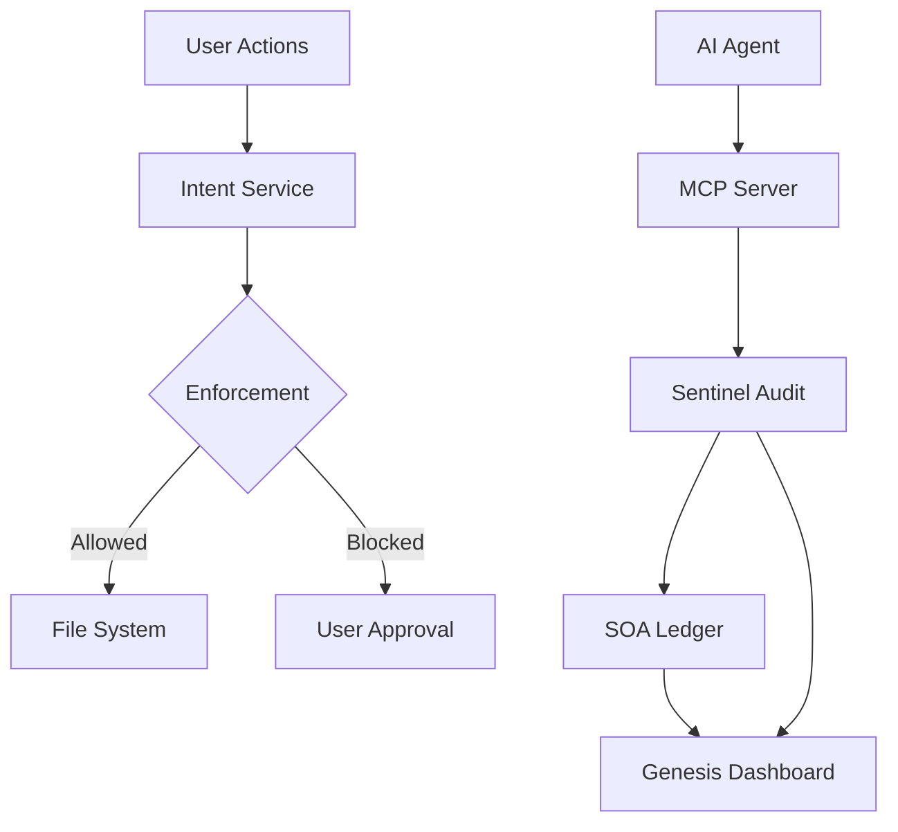

<div align="center">

# FailSafe

**A kernel architecture for governing autonomous AI agents**

[](https://github.com/MythologIQ/FailSafe/stargazers)
[](LICENSE)
[](#terms-and-conditions-beta)
[](https://nodejs.org)
[](https://www.typescriptlang.org)
[](https://marketplace.visualstudio.com/items?itemName=MythologIQ.mythologiq-failsafe)
[](https://open-vsx.org/extension/MythologIQ/mythologiq-failsafe)
[](FAILSAFE_SPECIFICATION.md)

> **If this project helps you, please star it!** It helps others discover FailSafe.

[Quick Start](#quick-example) | [Documentation](FAILSAFE_SPECIFICATION.md) | [VS Code Extension](https://marketplace.visualstudio.com/items?itemName=MythologIQ.mythologiq-failsafe) | [Open VSX](https://open-vsx.org/extension/MythologIQ/mythologiq-failsafe) | [Roadmap](ROADMAP.md)

<br/>

*FailSafe is open source. Fork it, open issues, and submit pull requests.*

> **BETA NOTICE:** FailSafe is a beta product. Expect breaking changes and rough edges. See [Terms and Conditions (Beta)](#terms-and-conditions-beta).

</div>

---

<p align="center">
  
</p>

---

## What You Will Configure in 5 Minutes

Create or edit `.failsafe/config/policies/risk_grading.json` to tune risk classification:

```json
{
  "filePathTriggers": {
    "L3": ["auth", "payment", "credential"]
  },
  "contentTriggers": {
    "L3": ["DROP TABLE", "api_key"]
  }
}
```

**Result:** Risk grading overrides are loaded on startup when this JSON file is present. Defaults apply when it is missing.

---

## What Is FailSafe?

FailSafe is an open-source VS Code extension and governance framework designed to harmonize AI agent behavior, prevent hallucinations, and enforce strict architectural standards across distributed development environments.

---

## The Idea

**Prompt-based safety** asks the LLM to follow rules. The LLM decides whether to comply.

**Kernel-based safety** intercepts actions before execution. The policy engine decides, not the LLM.

---

## Architecture



---

## Directory Structure

```
FailSafe/
├── .failsafe/                # Workspace configuration and policies
├── qorelogic/                # System manifests and templates
├── extension/                # VS Code extension source
├── docs/                     # Reference documentation
├── governance/               # Governance maps and alignment
└── FAILSAFE_SPECIFICATION.md # Source of truth
```

---

## Core Systems

| System | Layer | Description |
|--------|-------|-------------|
| Genesis | Experience | Dashboards and feedback loop |
| QoreLogic | Governance | Policies, identity, and intent verification |
| Sentinel | Enforcement | Audits, heuristics, and ledger logging |

---

## IDE Extension

| Extension | Description |
|-----------|-------------|
| VS Code | Real-time policy checks, audits, and dashboards |

---

## Install

### VS Code Marketplace

Install from the VS Code Marketplace:

https://marketplace.visualstudio.com/items?itemName=MythologIQ.mythologiq-failsafe

### Open VSX

Install from Open VSX:

https://open-vsx.org/extension/MythologIQ/mythologiq-failsafe

---

## Quick Example

```bash
# Run FailSafe locally
cd extension
npm install
npm run compile
```

---

## Status

This is a beta product. Expect breaking changes and rough edges.

---

## Terms and Conditions (Beta)

FailSafe is a beta product. It is provided "as is" without warranties of any kind, and may contain bugs, incomplete features, or breaking changes.

By using this software, you acknowledge that it is experimental and agree to use it at your own risk. MythologIQ is not liable for any loss of data, downtime, or other damages arising from use of this beta release.

---

## Contributing

```bash
git clone https://github.com/MythologIQ/FailSafe.git
cd FailSafe
npm install
```

---

## License

MIT - See [LICENSE](LICENSE)

---

<div align="center">

**Open source governance for autonomous AI agents.**

[GitHub](https://github.com/MythologIQ/FailSafe) | [Docs](FAILSAFE_SPECIFICATION.md)

</div>
