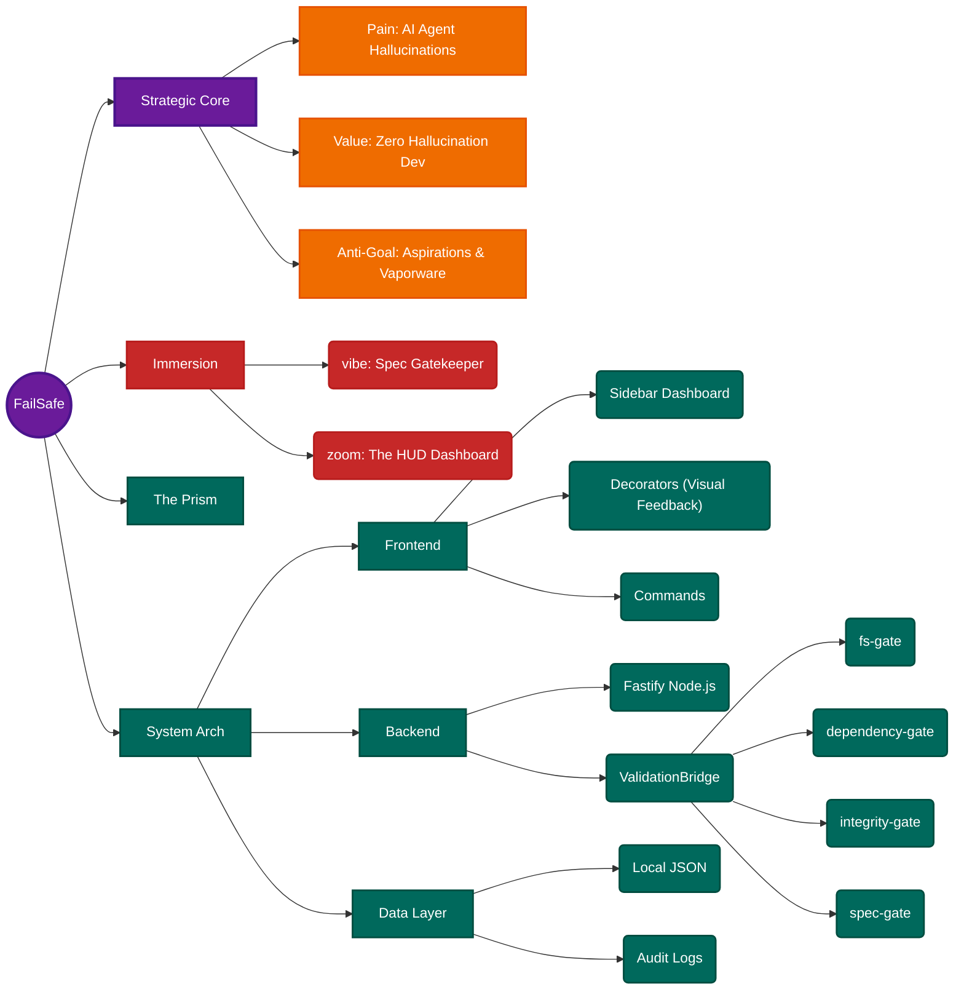

# Blueprint: Project FailSafe (v2.0 Rebirth)

**Status:** DRAFT
**Version:** 2.0.0 (Genesis Edition)
**Visionary:** The User
**Architect:** Antigravity (Dojo Master)

---

## I. Strategic Core (DeepWisdom)

### 1. Problem Statement

- **The Pain**: AI ("The Agent") is prone to "Hallucinations"—claiming files exist when they don't, promising features that aren't built, and drifting from the spec.
- **The Cost**: Broken trust, wasted developer cycles, and "vaporware" codebases.

### 2. Value Proposition

- **The Gain**: **Deterministic Reality Alignment**.
- **The Mechanism**: An **Active Enforcement Engine** (VS Code Extension) that gates every Agent action against the Spec and Reality.
- **The Core Loop**: Agent Proposes -> FailSafe Intercepts (Gates) -> Action Blocked if Invalid -> Agent Corrects.

### 3. Success Metrics (KPIs)

- [ ] **Zero False Claims**: 100% of "File X exists" claims are verified.
- [ ] **Passive Protection**: Validation happens < 3s without user intervention.
- [ ] **Accountability**: Every "Plan" has a "Proof" attached.

---

## II. Identity Framework

### - Problem Statement

- **Target**: Developers using AI Assistants (Cursor/Windsurf) who are tired of "Gaslighting".
- **Trouble**: "The AI lied to me again about the import path."

### - Personality

- **Vibe**: **The Spec Gatekeeper**. Cold, hard, factual. "Trust but Verify."
- **Tone**: Clinical, Precise, Unforgiving of ambiguity.

### - Mission Statement

- **Key Message**: "If it isn't in the file system, it doesn't exist."

### - Objectives

- **Primary Action**: "Validate Chat" -> **REPLACED BY**: "Process Enforcement".
- **Visuals**:
  - **The HUD**: A Dashboard showing "Hallucination Rate" and "Drift Status".
  - **The Wizard**: A structured, stepped UI for creating features (Concept -> Spec -> Plan -> Code).
  - **The Shield**: A green/red status bar indicator.

### 4. The "No-Loophole" Protocol

- **Problem**: Chat allows the Agent to bypass process ("Just fix it!").
- **Solution**: The UI _is_ the Process.
  - Phase 1 (Design) UI only allows editing Markdown specs.
  - Phase 2 (Code) UI is locked until Specs are approved.
  - **Constraint**: Discourage direct, unsupervised chat for Logic changes.

---

## III. System Architecture (The Machine)

### 1. The Frontend (VS Code Extension)

- **Sidebar**: Dashboard View (Metrics, Sprints).
- **Decorators**: Editor/Chat highlighting.
- **Commands**: `FailSafe: Validate Chat`, `FailSafe: Check Code`.

### 2. The Backend (The Oversight Kernel)

- **Technology**: Fastify (Node.js) + Universal Adapter.
- **Role**: The central "Environment Server" that enforces physics.
- **Heads (Interfaces)**:
  - **HTTP Head**: For Dashboard UI.
  - **MCP Head**: For Model Context Protocol clients (Claude/Antigravity).
  - **IPC Head**: For VSCode Extension.
  - **CLI Head**: For shell-based agents.
- **Plugins (Gates)**:
  - `fs-gate`: Validates file paths (Zero Hallucination).
  - `dependency-gate`: Cross-checks `package.json` vs Specs.
  - `integrity-gate`: Enforces `npm audit` security standards.
  - `spec-gate`: Validates AST compliance of Markdown specs.

### 3. The Data Layer

- **Storage**: Local JSON / Git Tags (No external database).
- **Logs**: `failsafe.log` (Audit Trail).

---

## IV. Execution Notes (Legacy extraction)

- **Keep**: The `Fastify` architecture (it was marked "Implemented").
- **Keep**: The `Dashboard` concept (Chart.js was integrated).
- **Discard**: Any "Planned" feature that was purely aspirational vaporware. We build _only_ what we can prove.

## V. Conceptual Mind Map

