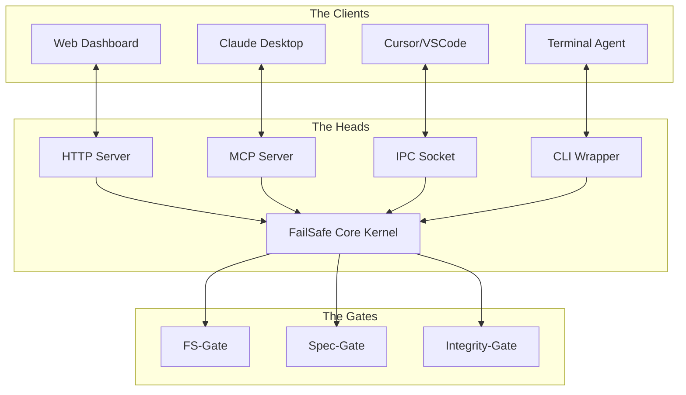

# FailSafe: Universal Bridge Architecture

## 1. The Core Concept: "Environment as Protocol"

FailSafe is currently designed as a VSCode Extension. This is a limitation. To truly serve as the "Oversight Kernel" for _any_ Agent (Antigravity, Cursor, Claude CLI, Codex CLI, Gemini), FailSafe must evolve into a **Universal Bridge**.

The **Universal Bridge** is a standalone, locally running "Environment Server" that exposes the Rigor/FailSafe protocols to any connected intelligence, regardless of the interface they are using.

---

## 2. The Universal Adapter Pattern

We define three integration tiers based on the Agent's capabilities:

### Tier 1: The Native Integrator (VSCode/Cursor)

- **Mechanism**: VSCode Extension API.
- **Integration**: Direct access to Editor UI, Decorations, and File System events.
- **Status**: _Existing Architecture_.

### Tier 2: The Protocol Client (MCP Support - Claude/Antigravity)

- **Mechanism**: **Model Context Protocol (MCP)**.
- **Integration**: FailSafe runs as an MCP Server.
- **Exposed Resources**:
  - `resources/spec`: Read-only access to solidified specs.
  - `resources/audit-log`: Real-time validation logs.
- **Exposed Tools**:
  - `validate_plan`: Submit a plan for checking.
  - `check_file`: Verify a file against the spec.
  - `get_project_status`: Context retrieval.
- **Prompts**: Injects "FailSafe Protocol" into the system prompt via MCP `prompts/`.

### Tier 3: The CLI Wrapper (Codex CLI / Shell Agents)

- **Mechanism**: **Shell Bootstrapping & Alias Injection**.
- **Integration**: A wrapper script (`failsafe`) that wraps the target CLI.
- **Workflow**:
  1.  User runs `failsafe codex "Fix the bug"`.
  2.  FailSafe pre-loads the context (Concept, Spec).
  3.  FailSafe injects a "Supervisor Prompt" into the input stream.
  4.  FailSafe watches the output/file system in real-time.
  5.  If "Hallucination" or "Violation" is detecting, FailSafe _interjects_ (if interactive) or _fails the build_ (if batch).

---

## 3. Architecture Specification

### The "Oversight Kernel"

The Node.js Fastify server (`src/server`) becomes the Kernel. It accepts inputs from multiple "Heads":

1.  **HTTP Head**: For the Dashboard UI.
2.  **MCP Head**: For Claude/Antigravity connections.
3.  **IPC Head**: For VSCode Extension communication.
4.  **CLI Head**: For shell interactions.

---

## 4. Detection & Bootstrapping

We need a standardized way to initialize the environment for an Agent.

**The Bootstrap Script (`.gemini/init_agent.sh` / `.ps1`)**:

1.  **Detects Agent**: Checks env vars or process arguments.
2.  **Generates Context**: Compiles `CONTEXT_MAP.json` and `active_spec.md`.
3.  **Configures Rules**: Outputs the "Constitution" in the format the agent expects.
    - _Claude_: Creates `.claude/config.json` (MCP config).
    - _Cursor_: Updates `.cursorrules`.
    - _Generic_: Creates `SYSTEM_PROMPT.txt` and copies to clipboard/env.

---

## 5. Protocol Projection (The "Law" Layer)

The Universal Bridge doesn't just enable communication; it enforces the _Laws_ of the workspace defined by Antigravity.

### Source of Truth

- **Constitution**: `.gemini/REPO_CONSTITUTION.md` (The Immutable Rules).
- **Workflows**: `.agent/workflows/*.md` (The Standard Procedures).

### The Projection Engine

When an external Agent connects (e.g., via `failsafe claude`), the Bridge performs **Protocol Projection**:

1.  **Rule Compilation**: It parses `REPO_CONSTITUTION.md` and extracts "Prime Directives".
    - _Output_: `SYSTEM_PROMPT_APPENDIX.txt` containing "You strictly adhere to these 5 rules...".
2.  **Workflow Exposure**: It scans `.agent/workflows/` and exposes them as usable "Tools" or "Capabilities".
    - _Example_: `start_feature.md` becomes a prompt instruction: "To start a feature, you must follow the steps in `start_feature.md`".
3.  **Context Injection**: It forces the Agent to acknowledge the "Current Mode" (Planning/Execution) defined in the workspace state.

### Adaptation Table

| Component        | VSCode/Cursor                  | Claude (MCP)                         | CLI Agent                  |
| :--------------- | :----------------------------- | :----------------------------------- | :------------------------- |
| **Constitution** | Enforced via Linter/Decorators | Injected into System Prompt          | Appended to Session Start  |
| **Workflows**    | Interactive Wizard Steps       | MCP Resource (`resources/workflows`) | ASCII Checklists in stdout |
| **Verification** | Automated Test Runner          | MCP Tool (`verify_task`)             | Shell Script (`./test.sh`) |

---

## 6. The "FailSafe" Command Protocol

When engaging with an external CLI agent, the user should be able to invoke:

`> failsafe <agent_command> [args]`

**Example:**
`> failsafe claude code "Refactor the authentication logic"`

**Behavior:**

1.  **Pre-Flight**:
    - FailSafe runs `npm audit` and `git status`.
    - If dirty/unsafe, it WARNS the user before launching the agent.
2.  **Injection**:
    - It appends the "FailSafe System Protocol" text to the user's prompt.
    - _Text_: "You are monitored by FailSafe. Do not hallucinate paths. Read SPEC.md first..."
3.  **Launch**:
    - Spawns the `claude` process.

### 3. Intent Detection (Heuristic Scouting)

The Bridge doesn't just pass text; it _scouts_ the prompt for clues to Pre-Load context.

**The "Scout" Mechanism**:
When the user provides input (e.g., via CLI arg or MCP Prompt Template):

1.  **Regex Scanning**: The Kernel scans for keywords (e.g., "fix", "test", "security", "slow").
2.  **Context Injection**:
    - _Clue_: "fix bug" -> **Action**: Pre-load `audit-log` and recent `git diff`.
    - _Clue_: "slow" -> **Action**: Pre-load `profile.json` or performance stats.
    - _Clue_: "refactor" -> **Action**: Pre-load the `Blueprint` to ensure architectural alignment.

**Result**: The Agent starts with the _relevant_ evidence already in its context window, reducing the "Discovery" round-trips.

4.  **Watchdog**:
    - FailSafe runs a file watcher in the background. If a file is created that doesn't match the spec, it logs a "Violation" to the console immediately.

---

## 6. Implementation Roadmap

## 7. Strategic Leverage: The MCP Advantage

To maximize impact with minimal code, we will leverage the **Model Context Protocol (MCP)** as our primary integration vector.

### Why MCP?

- **Universal Reach**: Native support in Claude Desktop, Cursor, and emerging IDEs.
- **Zero-UI Integration**: By exposing _Tools_ and _Resources_, we get a UI "for free" in the host agent.

### The "FailSafe" MCP Server

We will export `src/server` as a fully compliant MCP Server.

#### Exposed Resources (Context)

- `failsafe://constitution` -> Read-only view of `REPO_CONSTITUTION.md`.
- `failsafe://spec/active` -> The currently active Specification (compiled).
- `failsafe://tasks/pending` -> Live view of the Task Engine.

_Gain_: The Agent no longer needs to hunt for context. It is "grounded" in the FailSafe state automatically.

#### Exposed Prompts (Protocol)

- `failsafe-plan`: A prompt template that pre-fills the context with the Blueprint and Spec, forcing the agent to plan safely.
- `failsafe-review`: A prompt that pulls in the `audit-log` and asks the agent to self-correct.

_Gain_: We inject "Antigravity Physics" directly into the Agent's thought process before it even types a character.

### Universal Slash Commands

We will embed Antigravity Workflows (`.agent/workflows/*.md`) as "Slash Commands" in every environment:

| Workflow              | MCP Prompt Name  | CLI Alias           | Function                                    |
| :-------------------- | :--------------- | :------------------ | :------------------------------------------ |
| `start_feature.md`    | `/start_feature` | `failsafe feature`  | Initiates the "Spec-First" creation wizard. |
| `kata_shield_git.md`  | `/git_safety`    | `failsafe safe-git` | Runs the Git Safety Protocol checks.        |
| `pre_commit_audit.md` | `/audit`         | `failsafe audit`    | Runs the full verification suite.           |

### Process-Aware Prompts (State Enforcement)

These aren't just text snippets; they are **State Machines**. The MCP Server enforces pre-requisites before yielding the prompt.

**Example: `/audit` (The Gatekeeper)**

1.  **User Trigger**: Selects `/audit`.
2.  **Server Check**:
    - _Is `SPEC.md` clean?_ (If No -> Inject Error: "Fix Spec First").
    - _Is `package.json` synced?_ (If No -> Inject Warning).
3.  **Prompt Generation**:
    - If PASS: Generates a checklist prompt: "Reviewing artifacts X, Y, Z against Spec...".
    - If FAIL: Generates a Blocking prompt: "You cannot audit yet. Missing X."

**Example: `/start_feature` (The Wizard)**

1.  **Server Check**:
    - _Is previous task complete?_
2.  **Prompt Generation**:
    - Generates the "Analysis Phase" template with `concept.json` requirements pre-filled.

_Result_: The Agent cannot "skip ahead". The Slash Command _itself_ enforces the linear process.
